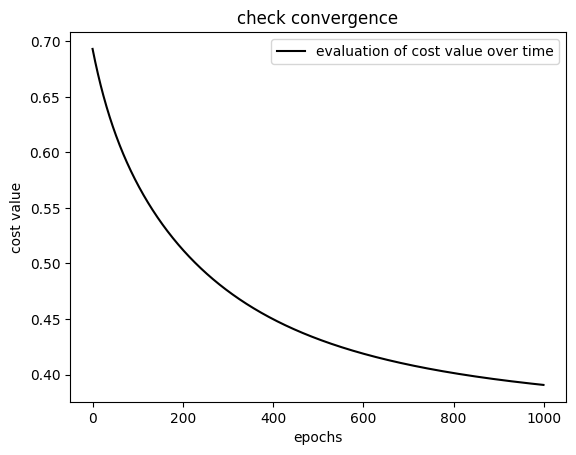
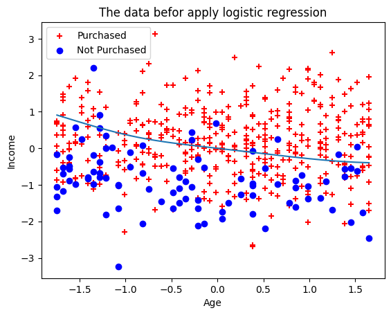

# Logistic Regression from Scratch

This project implements **logistic regression from scratch using NumPy**, including polynomial feature expansion and gradient descent optimization. The goal is to predict purchase behavior based on `Age` and `Income`.

## 📁 Dataset

The dataset used is `logistic-regression-purchase-predictionn.csv`, which contains:

- `Age`
- `Income`
- `Purchased` (target variable: 1 for purchased, 0 for not)

## 🛠️ Features

- Polynomial feature expansion (up to 4th degree + interaction term)
- Feature scaling (standardization)
- Logistic regression using batch gradient descent
- Custom cost function and convergence plotting
- Visualization of:
  - Data distribution
  - Decision boundary
  - Convergence curve (cost vs. epochs)

## 🧪 How it Works

### 1. **Preprocessing**
- The dataset is loaded using `pandas`.
- Standardization is applied to input features.
- Polynomial features are generated to capture non-linearity.

### 2. **Model Training**
- Logistic regression model is implemented manually.
- Parameters (`w` and `b`) are updated using gradient descent.
- The cost function is evaluated over epochs to ensure convergence.

### 3. **Evaluation**
- Final model accuracy is printed.
- A symbolic decision boundary is solved using `sympy` and plotted.

### 4. **Visualization**

#### 📉 Convergence Plot
Shows how the cost decreases over time:


#### 🔀 Decision Boundary Plot
Displays the logistic regression decision boundary:


## 📊 Results

- Model converges successfully (see above plots)
- Polynomial logistic regression improves decision boundary over linear models
- Final accuracy is printed at runtime

## 🚀 Requirements

- Python 3.x
- `numpy`
- `pandas`
- `matplotlib`
- `sympy`

Install dependencies via:

```bash
pip install numpy pandas matplotlib sympy
